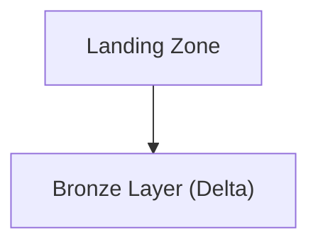
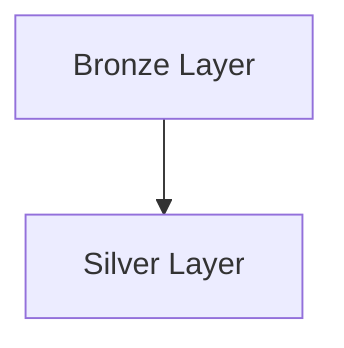
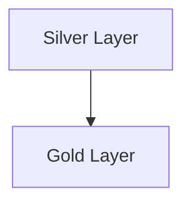
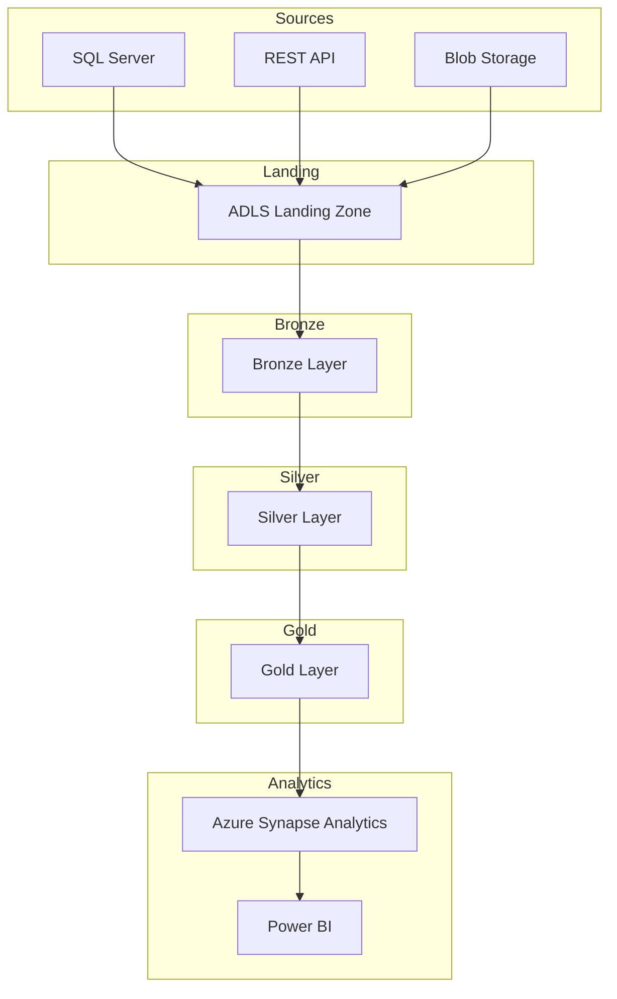

# Cloud Data Pipeline Development

## Project Overview
(Your project overview text)

## Data Sources
(Your data sources explanation)

## Azure Data Factory
(ADF explanation)

## Data Lake Architecture
(Bronze Silver Gold explanation)

## Azure Databricks Workflow
(Databricks transformation explanation)

## Synapse Analytics
(Synapse explanation)

## Power BI Dashboards
(Power BI explanation)

## Architecture Flow
(Mermaid diagram)

## PySpark Code
(Your PySpark code blocks)

---

# Cloud Data Pipeline Development 

## Project Overview

This project delivers a scalable cloud-based data engineering pipeline built on Microsoft Azure. The solution is designed to ingest, process, and analyze large volumes of transactional sales data, customer data, product data, and payment transactions from multiple enterprise systems.

The architecture supports both batch processing and near real-time analytics, enabling organizations to monitor sales performance, analyze customer behavior, and optimize product strategies.

The solution follows the **Medallion Architecture (Bronze, Silver, Gold)** and leverages Azure-native services such as Azure Data Factory, Azure Data Lake Storage Gen2, Azure Databricks, Azure Synapse Analytics, and Power BI.

---

# Data Sources

The solution integrates four primary enterprise data sources:

1. **On-Premise SQL Server**
   Historical order and customer data are ingested from an on-premise SQL Server using secure connectivity through Azure Data Factory.

2. **REST API**
   Product catalog and metadata are retrieved from external APIs.

3. **Azure Blob Storage**
   Payment gateway systems upload transaction files and logs to Azure Blob Storage.

4. **Flat Files (CSV / JSON)**
   Additional operational datasets such as inventory or transaction data are periodically uploaded in batch format.

---

# Azure Data Factory (ADF) for Ingestion and Orchestration

Azure Data Factory orchestrates the entire data pipeline and manages data movement from multiple source systems.

Key components used:

**Linked Services**

* SQL Server
* Azure Data Lake Storage Gen2
* REST API
* Azure Blob Storage

**Datasets**

* Orders dataset
* Customers dataset
* Products dataset
* Transactions dataset

**Activities**

* Copy Activity
* ForEach Activity
* Databricks Notebook Activity

ADF pipelines ensure reliable ingestion, scheduling, monitoring, and error handling across the data ecosystem.

---

# Data Lake Storage with Delta Format

All ingested data is stored in **Azure Data Lake Storage Gen2** using the **Medallion Architecture**.

### Bronze Layer

The Bronze layer stores raw data exactly as it arrives from the source systems.

Examples:

* orders_raw
* customers_raw
* product_catalog_raw
* transactions_raw

This layer preserves raw datasets for traceability and auditing.

---

### Silver Layer

The Silver layer contains cleansed and standardized datasets.

Transformations applied include:

* Removing duplicate records
* Handling null values
* Standardizing date and time formats
* Data validation and enrichment

Example datasets:

* orders_clean
* customers_clean
* products_clean
* transactions_clean

The Silver layer is stored in **Delta Lake format** to support schema enforcement and incremental updates.

---

### Gold Layer

The Gold layer contains curated datasets optimized for analytics and reporting.

Example datasets include:

* fact_sales
* dim_customers
* dim_products
* sales_summary_by_region
* customer_lifetime_value

These datasets provide business-ready insights for reporting tools.

---

# Data Processing with Azure Databricks

Azure Databricks processes the data using **PySpark notebooks**.

Transformations include:

* Data cleansing
* Deduplication
* Schema standardization
* Aggregation
* Incremental processing

Delta Lake features used:

* MERGE operations
* ACID transactions
* Schema enforcement
* Time travel

Databricks notebooks transform data between Bronze → Silver → Gold layers.

---

# Azure Synapse Analytics for Reporting

Curated Gold Layer data is loaded into **Azure Synapse Analytics**, which serves as the enterprise data warehouse.

Synapse provides:

* High-performance analytical queries
* Fact and dimension modeling
* Scalable reporting infrastructure

Example schema tables:

* fact_sales
* dim_customers
* dim_products

---

# Power BI for Visualization

Power BI connects to Azure Synapse Analytics to create interactive dashboards.

Example dashboards include:

* Total Revenue Dashboard
* Regional Sales Performance
* Customer Lifetime Value
* Product Sales Trends

These dashboards enable business users to make data-driven decisions.

---

# High-Level Architecture Flow

1. Data is ingested from SQL Server, REST APIs, Blob Storage, and flat files using Azure Data Factory.
2. Raw data lands in the Bronze Layer of ADLS Gen2.
3. Azure Databricks processes the data into Silver (cleaned and standardized) datasets.
4. Aggregated datasets are generated in the Gold Layer.
5. Gold datasets are loaded into Azure Synapse Analytics.
6. Power BI dashboards provide analytical insights to business stakeholders.

---

# Delta Lake Advantages

Delta Lake provides several benefits for the data pipeline:

* ACID transactions for reliable data processing
* Schema enforcement and validation
* Time travel for historical data analysis
* Efficient incremental data processing

These features ensure consistent and high-quality analytics data.

---

# Scalability and Business Insights

The architecture is designed to scale with increasing data volumes.

Key benefits include:

* Processing large-scale datasets efficiently
* Supporting incremental data updates
* Improving data quality and governance
* Delivering reliable analytics insights

This solution enables organizations to build a robust and scalable data analytics platform.

---

# Azure Databricks Workflow: End-to-End Data Movement and Transformation

## Overview

This section describes the Azure Databricks workflow used to ingest sales and customer data from multiple enterprise sources, store it in Azure Data Lake Storage Gen2, and transform it through Bronze, Silver, and Gold layers using PySpark.

---

# 1. Ingestion to Landing Zone (ADLS Gen2)

All source systems first land data into a raw landing zone within ADLS Gen2.

### PySpark Example: Ingesting Data from SQL Server

```python
from pyspark.sql import SparkSession

spark = SparkSession.builder.getOrCreate()

orders_df = spark.read.format("jdbc").option(
"url","jdbc:sqlserver://server:1433;databaseName=salesdb"
).option(
"user","username"
).option(
"password","password"
).option(
"dbtable","dbo.orders"
).load()

orders_df.write.mode("overwrite").parquet("abfss://landing@storage.dfs.core.windows.net/orders/")
```

Reasoning:

* PySpark enables distributed processing of large datasets
* Parquet format improves storage efficiency and query performance
* Landing zone keeps raw copies of all source datasets

---

# 2. Landing Zone to Bronze Layer

Raw landing datasets are converted into Delta format.



### PySpark Example

```python
landing_path = "abfss://landing@storage/orders/"
bronze_path = "abfss://bronze@storage/orders/"

raw_df = spark.read.parquet(landing_path)

raw_df.write.format("delta").mode("overwrite").save(bronze_path)
```

Reasoning:

* Delta format supports ACID transactions
* Bronze layer preserves raw data lineage

---

# 3. Bronze to Silver Layer

The Silver layer applies business logic and data cleansing.



### PySpark Example

```python
bronze_df = spark.read.format("delta").load(bronze_path)

clean_df = bronze_df.dropDuplicates(["order_id"])

clean_df.write.format("delta").mode("overwrite").save("abfss://silver@storage/orders/")
```

Reasoning:

* Deduplication improves data quality
* Silver layer standardizes the data schema

---

# 4. Silver to Gold Layer

The Gold layer creates aggregated datasets for analytics.



### PySpark Example

```python
from pyspark.sql.functions import sum

sales_df = spark.read.format("delta").load("abfss://silver@storage/orders/")

gold_df = sales_df.groupBy("region").agg(sum("total_amount").alias("total_sales"))

gold_df.write.format("delta").mode("overwrite").save("abfss://gold@storage/sales_summary/")
```

Reasoning:

* Aggregations enable fast analytical queries
* Gold layer datasets are optimized for reporting tools

---

# Full Workflow Diagram



---

